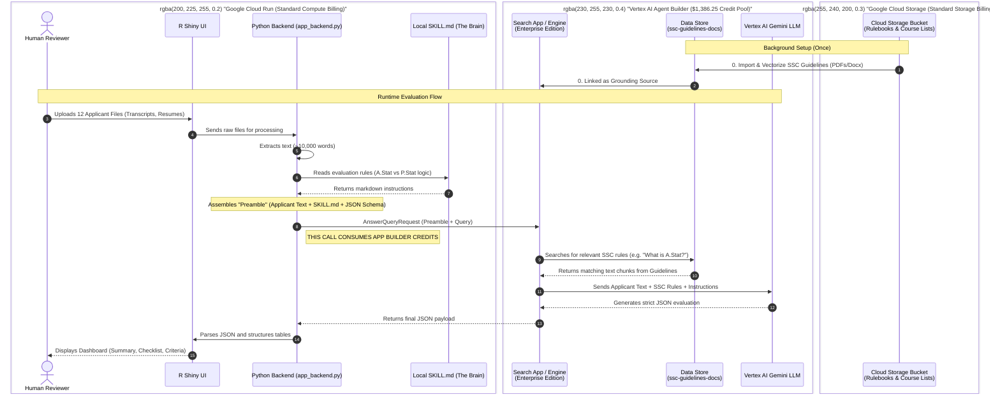

# SSC Review Agent: System Architecture & Billing Flow

This diagram illustrates the end-to-end flow of the SSC Review Agent. It highlights the boundary between standard Google Cloud infrastructure (billed normally) and the Vertex AI Agent Builder components (which consume your $1,386.25 AI Application credits).

## Understanding the Billing Boundaries

### 🟢 The "Green Zone" (App Builder Credits)
The entire right side of the diagram (The **Search App / Engine**, the **Data Store**, and the underlying **Gemini** model it uses) is wrapped into a single Google Cloud SKU called **AI Application - Grounded Generation**.
* Because our Python code talks *only* to the Search App (`ssc-review-app_1776607831356`), all the heavy LLM processing and searching is billed against your $1,386.25 credit pool.

### 🔵 The "Blue/Orange Zones" (Standard / Free Tier Billing)
* **Cloud Run (R Shiny + Python):** Hosting the web interface and running the text extraction scripts uses standard CPU/RAM. Cloud Run has a massive free tier (2 million requests/month), so this costs virtually nothing.
* **Cloud Storage:** Storing your PDF guidelines costs standard storage rates (pennies per month).
